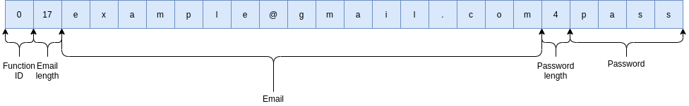
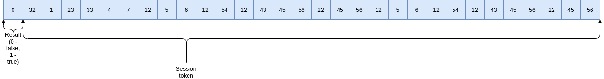

# Server communication protocol desctiption

Server based on TCP sockets. For multiplexing "poll" is using.  <h5> Communications algorithm:  
1. Receive packet size (this size garanted will be 4 bytes).  
2. Receive packet  
3. Use first byte for command recognition(0- Account registration, 1 - authorization ... (see ServerAPI.md))  
4. Run handler function  
5. Send answer if needed  
The function arguments are taken from the received data packet.  
Data packet template:  
<i>function descriptor (first byte), argument 1 length, argument 1, ... . </i>  
<h6>Example:</h6>
Account registration:  
Data size: 29 
Data packet (converted to string): 
<i>017example@gmail.com8password</i> 
0 - function descriptor  
17 - length of first string parameter  
example@gmail.com - user's email  
password - user's password  
Answer to client: 
Data size: 33  
Data packet (converted to string): 
<i>1477df96bf4a8dc6c4ffe52f6a5f93860</i> 
1 - result of operation (if operation failed, after result goes error message with message length)  
477df96bf4a8dc6c4ffe52f6a5f93860 - session token  
</h5>

<h3>Functions parameters</h3> 
<h4>Account registration/Authorization:</h4> 

<h5>Answer to client:</h5> 

<h6>First byte - function ID(0 - registration, 1 - log in). Second byte - an email length. After second byte goes an user's email. After the user's email goes a password's size and after it goes password.If authorization function on server's side returns with some errors: first byte - 0; second byte - error's ID (client's side has a table with errors' description).Otherwise: first byte - 1; byte from 2 to 33 - session token.</h6> 

<h4>Logout:</h4>
<h6>First byte - 2;  
Bytes from 2 to 33 - session token. </h6>
<h5>Answer to client:</h5>
<h6>On success: single byte - 1.  
Otherwise: first byte - 0, second byte - error's ID.  </h6>

<h4>Get list of nodes:</h4>
<h6>First byte - 3; 
Bytes from 2 to 33 - session token; </h6>
<h5>Answer to client:</h5>
<h6>On success:  first byte - 1; second byte - nodes count; After them: (byte of nodes length)(nodes ID). Otherwise:  Fist byte - 0; Second byte - error's ID </h5>

<h4>Get list of files:</h4>
<h6>First byte - 4; 
Bytes from 2 to 33 - node id; </h6>
<h5>Answer to client:</h5>
<h6>On success:  first byte - 1; second byte - filenames count; After them: (byte of filenames length)(filename). Otherwise:  Fist byte - 0; Second byte - error's ID </h5>

<h4>Upload files:</h4>
<h6>First byte - 5; 
Bytes from 2 to 33 - node id;  Byte 34 - files' count; After them: (filename length)(filename)(filesize)(file's buffer) </h6>
<h5>Answer to client:</h5>
<h6>On success: single byte - 1; Otherwise: first byte - 0, second byte - error's ID.</h5>

<h4>Delete file from node:</h4>
<h6>First byte - 6; 
Bytes from 2 to 33 - node id; After it: (filename length)(filename)(32 bytes of session token)</h6>
<h5>Answer to client:</h5>
<h6>On success: single byte - 1; Otherwise: first byte - 0, second byte - error's ID.</h5>

<h4>Get file info:</h4>
<h6>First byte - 7; 
Bytes from 2 to 33 - node id; After it: (filename length)(filename)</h6>
<h5>Answer to client:</h5>
<h6>On success: first byte - 1, after it: (text length)(text) Otherwise: first byte - 0, second byte - error's ID.</h5>

<h4>Create a new node:</h4>
<h6>First byte - 8; 
Bytes from 2 to 33 - session token. </h6>
<h5>Answer to client:</h5>
<h6>On success: first byte - 1, bytes from 2 to 33: node ID. Otherwise: first byte - 0, second byte - error's ID.</h5>

<h4>Download files:</h4>
<h6>First byte - 9; 
Bytes from 2 to 33 - session token.(files list size)(files list)(files' buffers) </h6>
<h5>Answer to client:</h5>
<h6>On success: single byte - 1. Otherwise: first byte - 0, second byte - error's ID.</h5>

<h4>Reset password:</h4>
<h6>First byte - 10; 
Bytes from 2 to 33 - session token. </h6>
<h5>Answer to client:</h5>
<h6>On success: first byte - 1, bytes from 2 to 66: temporary password. Otherwise: first byte - 0, second byte - error's ID.</h5>

<h4>Rename file:</h4>
<h6>First byte - 11; 
(session token)(node ID)(old filename size)(filename)(new filename size)(new filename) </h6>
<h5>Answer to client:</h5>
<h6>On success: single byte - 1. Otherwise: first byte - 0, second byte - error's ID.</h5>

<h4>Change password:</h4>
<h6>First byte - 12; 
(session token)(old password size1)(old password 1)(old password size 2)(old password 2)(new password size)(new password) </h6>
<h5>Answer to client:</h5>
<h6>On success: single byte - 1. Otherwise: first byte - 0, second byte - error's ID.</h5>

